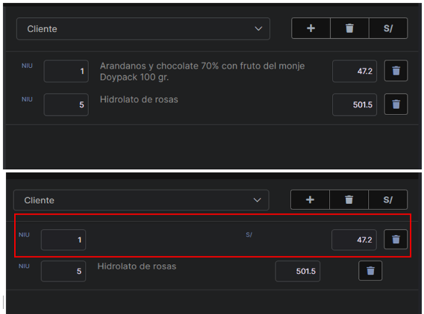

# Error Numero 2

### Error en la seccion de Venta rapida
Al colocar el puntero encima de los productos, estos alteran su diseño y no se puede visualizar el nombre del producto. Esto puede ser causado por el signo de soles que aparece al colocar el puntero. La solucion dada es ubicar el signo de soles a un lado del precio.

